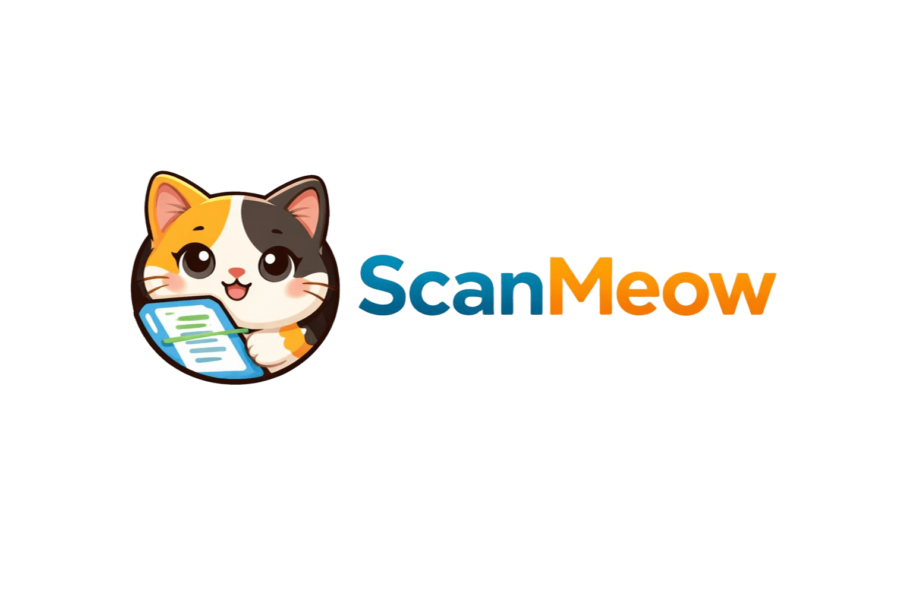

<div align="center">
  

  # ScanMeow

  **Scan paper documents on your phone and find the PDF on your desktop moments later.**

  
  
  
  
  

  [Demo video](https://www.youtube.com/watch?v=V8gH5v0GeD4)
</div>

---

ScanMeow is a **cross-platform document scanning system** with three interconnected components: an Android mobile app, a Windows desktop client, and a Supabase cloud backend. Photograph a paper document on your phone and the PDF lands in your desktop inbox automatically, either through cloud sync or a direct Bluetooth transfer.

---

## Table of Contents

- [Architecture](#architecture)
- [Features](#features)
- [Tech Stack](#tech-stack)
- [Data Flow](#data-flow)
- [Project Structure](#project-structure)
- [Setup Guide](#setup-guide)
- [Environment Variables](#environment-variables)
- [Vision Prototype](#vision-prototype)
- [License](#license)

---

## Architecture

```
┌─────────────────────────────────────────────────────────────┐
│                         ScanMeow                            │
│                                                             │
│  ┌──────────────────┐        ┌──────────────────────────┐  │
│  │  Android App     │        │   Supabase Cloud         │  │
│  │  (Kotlin/Compose)│◄──────►│   PostgreSQL + Storage   │  │
│  │                  │  HTTPS │   Row-Level Security      │  │
│  │  • CameraX       │        └──────────┬───────────────┘  │
│  │  • PDF generation│                   │ Poll / Download   │
│  │  • Google OAuth  │        ┌──────────▼───────────────┐  │
│  │  • Bluetooth send│◄──────►│   Desktop Client         │  │
│  └──────────────────┘ RFCOMM │   (Python / PyQt5)       │  │
│                              │   • Bluetooth receiver    │  │
│  ┌──────────────────┐        │   • Cloud sync thread    │  │
│  │  Vision Prototype│        │   • PDF inbox & viewer   │  │
│  │  FastAPI + OpenCV│        └──────────────────────────┘  │
│  │  (Optional REST) │                                       │
│  └──────────────────┘                                       │
└─────────────────────────────────────────────────────────────┘
```

| Component | Technology | Role |
|-----------|-----------|------|
| Mobile App | Android — Kotlin + Jetpack Compose | Camera capture, PDF generation, upload & Bluetooth send |
| Desktop Client | Python 3 + PyQt5 | PDF inbox, cloud sync, Bluetooth receiver, file manager |
| Cloud Backend | Supabase (PostgreSQL + Storage) | User auth, document metadata, PDF storage bucket |
| Vision Prototype | FastAPI + OpenCV | Experimental edge-detection / de-skew REST endpoint |

---

## Features

### Mobile App

- **Google Sign-In** — OAuth via Google Play Services; no separate credentials to manage.
- **Document Capture** — CameraX with resolution capped at 1920 × 1440 for fast processing.
- **CamScanner-style Crop** — Draggable corner handles for manual perspective correction.
- **PDF Generation** — Converts the captured image to a single-page PDF entirely in memory on the device.
- **Cloud Upload** — PDF bytes are uploaded to Supabase Storage and a metadata row is inserted atomically.
- **Bluetooth Transfer** — Non-blocking RFCOMM fallback using the SMK2 binary protocol sends the PDF directly to a paired PC.
- **Cloud Document Manager** — Browse, rename, and delete your own scans; secured by Supabase Row-Level Security.

### Desktop Client

- **Bluetooth Receiver** — Listens on RFCOMM channel 6 for incoming transfers from the mobile app.
- **Cloud Sync** — Background thread polls Supabase every 12 seconds and downloads new PDFs automatically.
- **PDF Viewer** — Opens any file in the inbox using PyMuPDF (fitz).
- **Google OAuth** — Same identity as the mobile app; documents are always user-scoped.
- **Status Feedback** — Real-time UI indicators for Bluetooth connection state and sync activity.

### Cloud Backend (Supabase)

- **Row-Level Security** — Users can only read and write their own rows; enforced at the database level.
- **Storage Bucket** — `scans` private bucket with path-based RLS (`{user_uuid}/filename.pdf`).
- **Efficient Queries** — Composite index on `(user_id, created_at_millis DESC)` for fast inbox loads.

---

## Tech Stack

| Layer | Technology | Version |
|-------|-----------|---------|
| Mobile language | Kotlin | 2.0.21 |
| Mobile UI | Jetpack Compose (Material 3) | BOM 2024.09.00 |
| Mobile architecture | MVVM — ViewModel + LiveData | — |
| Camera | CameraX | 1.3.4 |
| HTTP client | OkHttp | 4.12.0 |
| Image loading | Coil 3 | 3.4.0 |
| Navigation | Compose Navigation | 2.8.9 |
| Local storage | Room / SQLite | — |
| Authentication | Google Play Services Auth | 21.5.1 |
| Cloud backend | Supabase | PostgreSQL + Storage |
| Desktop UI | PyQt5 | ≥ 5.15 |
| Desktop PDF | PyMuPDF (fitz) | ≥ 1.23 |
| Vision — core | OpenCV | ≥ 4.2 |
| Vision — AI | DocRes + PyTorch | optional |
| Vision — API | FastAPI + Uvicorn | ≥ 0.115 |
| Android target SDK | 36 | min 24 |

---

## Data Flow

```
Phone Camera
     │
     ▼  CameraX captures frame
Image Processing (on-device)
     │
     ▼  Perspective crop  →  PDF bytes in memory
         ┌──────────────────────────────┐
         │                              │
         ▼ Primary path                 ▼ Fallback
  Supabase Upload                 Bluetooth RFCOMM
  • Storage bucket (scans)        • SMK2 binary protocol
  • documents table row           • Channel 6, non-blocking
         │
         ▼
  Desktop sync thread polls every 12 s
         │
         ▼
  PDF saved to local inbox  →  PyQt5 list refreshes
```

1. **Scan** — User taps *Scan*; CameraX captures the image.
2. **Crop** — Optional manual corner-drag crop for perspective correction.
3. **Convert** — Image is converted to a single-page PDF in memory on the device.
4. **Upload** — PDF bytes are uploaded to the `scans` Supabase Storage bucket and a row is inserted in the `documents` table.
5. **Sync** — The desktop client detects the new row within 12 seconds, downloads the PDF, and adds it to the local inbox.
6. **Bluetooth fallback** — The mobile app also attempts a direct RFCOMM transfer; this path is non-blocking and fails gracefully if unavailable.
7. **Manage** — Users can rename, delete, or open PDFs from both the mobile *Cloud* screen and the desktop list.

---

## Project Structure

```
ScanMeow/
├── mobile-app/                     # Android Studio project
│   └── app/src/main/java/com/project/scanmeow/
│       ├── MainActivity.kt
│       ├── navigation/NavGraph.kt
│       ├── viewmodel/AppViewModel.kt
│       ├── bluetooth/BluetoothSend.kt
│       ├── data/
│       │   ├── SupabaseDocumentsRepository.kt
│       │   ├── db/DocumentStorage.kt
│       │   └── model/Document.kt
│       └── ui/
│           ├── home/               # Scanner, Crop, Review, PDF preview screens
│           └── screens/            # Home, Bluetooth, Document, Confirm screens
│
├── desktop-app/                    # Python desktop client
│   ├── main.py
│   └── app/
│       ├── main_window.py          # PyQt5 UI
│       ├── supabase_client.py      # Supabase API calls
│       ├── supabase_sync.py        # Background sync thread
│       ├── google_oauth_desktop.py # Google sign-in
│       └── document_manager.py     # Local file operations
│
├── vision-prototype/               # OpenCV scanning pipeline (optional)
│   ├── scanner.py                  # Perspective transform + enhancement
│   ├── api_server.py               # FastAPI REST wrapper
│   ├── ai/shadow_removal.py        # DocRes AI shadow removal
│   └── requirements*.txt
│
└── supabase/
    └── migrations/                 # SQL schema & RLS policies
```

---

## Setup Guide

### Prerequisites

- Android Studio Ladybug or newer (for mobile)
- Python 3.9+ (for desktop / vision)
- A Supabase project with Google OAuth enabled
- A Google Cloud project with an OAuth 2.0 Web Client ID

---

### 1 — Supabase Schema

Run the migration file to create the database schema, storage bucket, and RLS policies:

```bash
supabase db push
# or apply directly:
psql "$DATABASE_URL" -f supabase/migrations/20260327000000_scanmeow_documents.sql
```

---

### 2 — Mobile App

1. Open `mobile-app/` in Android Studio and let Gradle sync.
2. Copy the template below to `mobile-app/local.properties` (already git-ignored):

```properties
supabase.url=https://<project-ref>.supabase.co
supabase.anon.key=<your-anon-key>
google.web.client.id=<your-web-oauth-client-id>.apps.googleusercontent.com
# Optional — vision API; default targets Android emulator host
scan.api.base=http://10.0.2.2:8765
```

3. Build and run on a device with Android 7.0+ (API 24+).

---

### 3 — Desktop Client

```bash
cd desktop-app
python -m venv .venv && source .venv/bin/activate   # Windows: .venv\Scripts\activate
pip install -r requirements.txt
```

Create a `.env` file in `desktop-app/`:

```env
SUPABASE_URL=https://<project-ref>.supabase.co
SUPABASE_ANON_KEY=<your-anon-key>
GOOGLE_CLIENT_ID=<your-web-oauth-client-id>.apps.googleusercontent.com
GOOGLE_CLIENT_SECRET=<your-client-secret>
```

Run the app:

```bash
python main.py
```

---

### 4 — Vision Prototype *(optional)*

```bash
cd vision-prototype
pip install -r requirements.txt           # core OpenCV pipeline
pip install -r requirements-api.txt       # FastAPI server
# Optional AI features:
pip install -r requirements-ai.txt
python scripts/setup_ai.py
```

Start the REST server (defaults to port **8765**):

```bash
run_api.bat          # Windows
# or:
uvicorn api_server:app --host 0.0.0.0 --port 8765 --reload
```

CLI usage:

```bash
python scanner.py input.jpg --binarize --whiten --sharpen
```

---

## Environment Variables

| Variable | Component | Description |
|----------|-----------|-------------|
| `supabase.url` | Mobile (`local.properties`) | Supabase project URL |
| `supabase.anon.key` | Mobile (`local.properties`) | Supabase anon/public key |
| `google.web.client.id` | Mobile (`local.properties`) | Google OAuth Web Client ID |
| `scan.api.base` | Mobile (`local.properties`) | Vision API base URL |
| `SUPABASE_URL` | Desktop (`.env`) | Supabase project URL |
| `SUPABASE_ANON_KEY` | Desktop (`.env`) | Supabase anon/public key |
| `GOOGLE_CLIENT_ID` | Desktop (`.env`) | Google OAuth Client ID |
| `GOOGLE_CLIENT_SECRET` | Desktop (`.env`) | Google OAuth Client Secret |

---

## Vision Prototype

The `vision-prototype/` module is a standalone OpenCV pipeline that performs geometric correction and image enhancement independently of the mobile app. It exposes a REST API so any client can send a raw photo and receive a cleaned scan:

```
POST /scan?binarize=true&whiten=true&sharpen=true
Content-Type: multipart/form-data
→ Returns: image/jpeg
```

Optional AI features (DocRes model) add shadow removal and appearance enhancement. The pipeline also supports a Mobile SAM model for segment-based processing.

---

## License

See [LICENSE](LICENSE) for terms of use.
